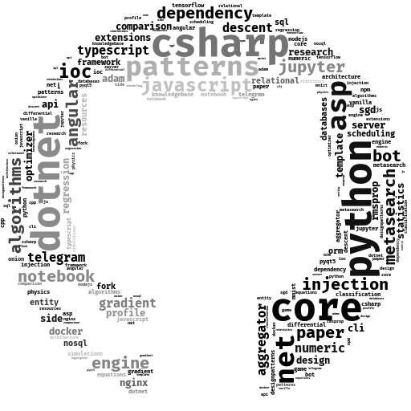

<h1></h1>

<ul>
  <li>:ledger: I’m getting my master’s in Data Science and Mathematical modelling;</li>
  <li>:microscope: I'm working on a <a href="https://github.com/antonAce/adaptive-gradient-descent">research</a> for optimization algorithms;</li>
  <li>:handshake: I'm looking for a collaboration / contribution for the projects;</li>
  <li>:seedling: I learn everything related to the <strong>Big Data</strong> and <strong>AI</strong>;
</ul>

 

